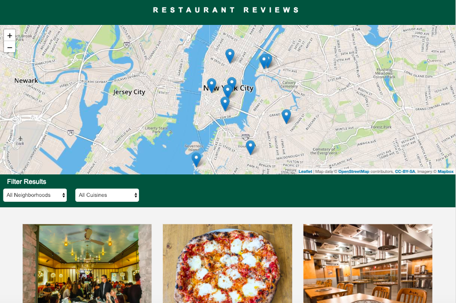

# Restaurant Review App (Stage 1)

## Table of Contents

* [Project Overview](#project-overview)
* [Built with](#built-with)
* [Installation](#installation)
* [Licence](#licence)

## Project Overview

This is the fifth project of the Udacity's Nanodegree Front-End Developer. The initial app lacked accessibility, responsive design, and didn't cache assets. The task was to convert a static webpage to a mobile-ready web application, implement web accessibility and make the app cache assets for offline use.

## Built with

The starter code and assets were already provided by the Udacity. The app was built with the following languages and resources:

- HTML
- CSS
- JavaScript
- MapBox API

## Installation

- Download this repository to the desktop.
- Open the root folder in a terminal.
- Start a local HTTP server. Python has simple tools for it. To do this, check the version of Python you already have by using this in the terminal `python -V`. For Python 2.x, use `python -m SimpleHTTPServer 8000` in your terminal. For Python 3.x, you can use `python3 -m http.server 8000`. If you don't have Python installed, you can download it on Python's website.
In Windows systems Python 3.x is already installed by default. To start a Python 3.x server, enter `python -m http.server 8000`.
- When your server runs, open the site in your browser: `http://localhost:8000`.

## Licence

- This project is licensed under the terms of the [MIT licence](https://en.wikipedia.org/wiki/MIT_License).
